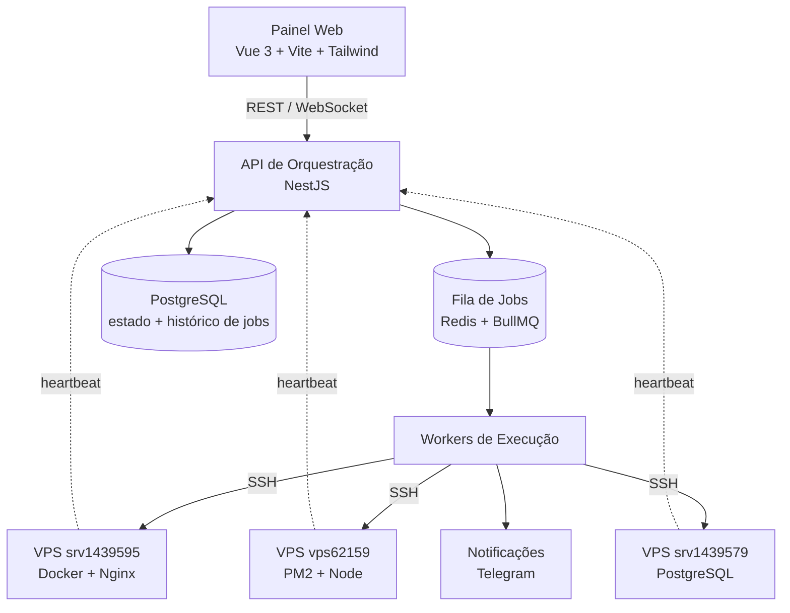

# AgentGrid — Orquestração de Frota de VPS

> Painel de orquestração que centraliza o gerenciamento e a delegação de tarefas através de uma frota de servidores VPS Linux, com deploy automatizado, monitoramento de saúde e alertas operacionais em tempo real.

> **Nota:** este repositório documenta a **arquitetura e as decisões de design** do AgentGrid. O código de produção é privado por conter integrações e credenciais de clientes. O objetivo aqui é demonstrar o raciocínio arquitetural por trás do sistema, não distribuir o código.

---

## 1. Contexto & Problema

Eu mantenho múltiplos produtos web e mobile em produção (plataformas SaaS, sistemas institucionais e e-commerces), distribuídos por uma frota de VPS Linux. Antes do AgentGrid, a operação tinha três dores claras:

- **Deploy manual via SSH:** cada atualização exigia conectar no servidor certo, lembrar o caminho do serviço e rodar os comandos na mão, sujeito a erro humano.
- **Zero visão centralizada:** não havia um lugar único para saber a saúde de todos os serviços. Descobrir que um processo caiu frequentemente dependia de um cliente reclamar primeiro.
- **Conhecimento não codificado:** os passos de operação de cada servidor viviam na minha cabeça, o que torna o sistema impossível de delegar e arriscado em caso de indisponibilidade minha.

O AgentGrid nasceu para transformar essa operação artesanal em um fluxo padronizado, observável e auditável.

**Restrições do projeto:**
- **Sem Kubernetes gerenciado** — o orçamento de infra e a escala atual não justificam o overhead operacional de um cluster.
- **Mantenedor único** — eu sou o responsável técnico. A solução precisa ser operável e mantida por uma pessoa só.
- **Frota heterogênea** — os serviços rodam em formatos diferentes (containers Docker, processos sob PM2, apps Node), e a solução precisa lidar com todos.

---

## 2. Visão de Arquitetura

O painel emite uma intenção (ex.: "fazer deploy do serviço X"). A API valida, persiste o estado e enfileira um job. Um worker consome o job, executa os comandos no VPS-alvo via SSH, registra o resultado no histórico e dispara um alerta no Telegram em caso de falha. Os servidores também reportam heartbeat periódico, alimentando a visão de saúde da frota.

---

## 3. Decisões Técnicas (e os trade-offs)

> Esta é a seção que mais importa. Cada decisão = **o que escolhi, por quê, e o que abri mão.**

### 3.1 Filas assíncronas (Redis + BullMQ) em vez de execução síncrona no request
**Decisão:** tarefas de deploy e manutenção entram em uma fila e são processadas por workers desacoplados da API.
**Por quê:** comandos SSH em múltiplos servidores são lentos e podem falhar parcialmente. Segurar a requisição HTTP até o fim de uma operação que leva dezenas de segundos seria frágil (timeouts) e não daria espaço para retry.
**Trade-off:** ganhei resiliência, retry automático e a capacidade de processar várias operações em paralelo, mas paguei com complexidade extra: precisei garantir **idempotência dos jobs** (reexecutar não pode causar efeito duplicado) e adicionar observabilidade sobre o que está na fila.

### 3.2 PostgreSQL como fonte única de verdade do estado da frota
**Decisão:** todo o estado (servidores, serviços, histórico de execuções, status atual) vive no PostgreSQL; o painel é apenas uma projeção desse estado.
**Por quê:** preciso de histórico auditável ("quem rodou o quê, quando, e qual foi o resultado") e de consultas relacionais sobre a frota. Um banco relacional com Prisma me dá integridade, migrations versionadas e queries expressivas.
**Trade-off:** o estado em tempo real depende de heartbeat + persistência, o que introduz uma pequena janela de defasagem entre "o que o banco diz" e "o que o servidor está fazendo neste instante". Aceitável para o caso de uso; resolvido na UI com indicação de "última atualização".

### 3.3 SSH direto a partir dos workers, sem agente instalado em cada VPS
**Decisão:** os workers se conectam por SSH com autenticação por chave, em vez de instalar um agente residente em cada servidor.
**Por quê:** zero footprint nos servidores-alvo, nada novo para manter, atualizar ou monitorar do lado deles. Funciona igual em qualquer VPS Linux, independente do provedor.
**Trade-off:** abri mão de capacidades que um agente daria de graça (push de métricas detalhadas, reação local imediata). Para a escala atual, a simplicidade venceu. Documentei isso na seção "O que eu faria diferente".

### 3.4 Monolito modular (NestJS) em vez de microsserviços
**Decisão:** a aplicação é um monolito organizado em módulos NestJS (orquestração, frota, jobs, notificações), não um conjunto de microsserviços.
**Por quê:** sendo o único mantenedor, microsserviços adicionariam overhead operacional (deploy, rede, observabilidade distribuída) sem benefício real na escala atual. A estrutura modular do NestJS já dá separação de responsabilidades e um caminho de migração futura se a escala exigir.
**Trade-off:** acoplamento maior no deploy (tudo sobe junto), em troca de uma operação drasticamente mais simples. Decisão consciente de adequar a arquitetura ao tamanho do problema, não ao currículo.

---

## 4. Stack

| Camada | Tecnologia | Motivo |
|---|---|---|
| Frontend | Vue 3 + Vite + TailwindCSS | Reatividade, build rápido e UI consistente sem CSS custom |
| API | NestJS + TypeScript | Estrutura em camadas, injeção de dependência nativa, fácil de testar |
| Fila | Redis + BullMQ | Jobs assíncronos com retry, agendamento e controle de concorrência |
| Banco | PostgreSQL + Prisma | Integridade relacional, migrations versionadas, histórico auditável |
| Infra alvo | Docker · Nginx · PM2 | Formatos reais dos serviços geridos na frota |
| Comunicação | SSH (chave) · WebSocket · Telegram Bot | Execução remota, atualização ao vivo do painel e alertas |

---

## 5. Escala & Resultados

> **Ajuste estes números para os seus valores reais antes de publicar.** Faixa honesta vale mais que número inventado.

- Frota de **~[N] VPS** Linux sob gestão centralizada (ex.: srv1439595, vps62159, srv1439579).
- **[N] produtos/serviços** em produção orquestrados pelo painel.
- Deploys que antes exigiam **conexão SSH manual e múltiplos comandos** passaram a ser disparados em **1 clique** pelo painel.
- Detecção de queda de serviço migrou de **reativa (cliente avisa)** para **proativa (alerta no Telegram)**.

---

## 6. O que eu faria diferente

- **Observabilidade:** hoje o monitoramento é via heartbeat próprio. Em uma escala maior, migraria para Prometheus + Grafana para métricas e alertas mais ricos.
- **Agente leve opcional:** para servidores críticos, um agente residente daria reação local imediata sem depender do ciclo de heartbeat.
- **Testes:** adicionar uma suíte de testes de integração nos workers, simulando falhas de SSH e garantindo a idempotência dos jobs sob retry.

---

## 7. Aprendizados

O AgentGrid me ensinou a **dimensionar a arquitetura ao tamanho real do problema** em vez de ao hype. A escolha mais difícil não foi técnica, foi resistir à tentação de microsserviços e Kubernetes: o ganho de manutenibilidade de um monolito modular bem organizado, operável por uma pessoa, superou de longe a sofisticação que não traria valor na escala atual. Boa arquitetura é a que você consegue manter.
